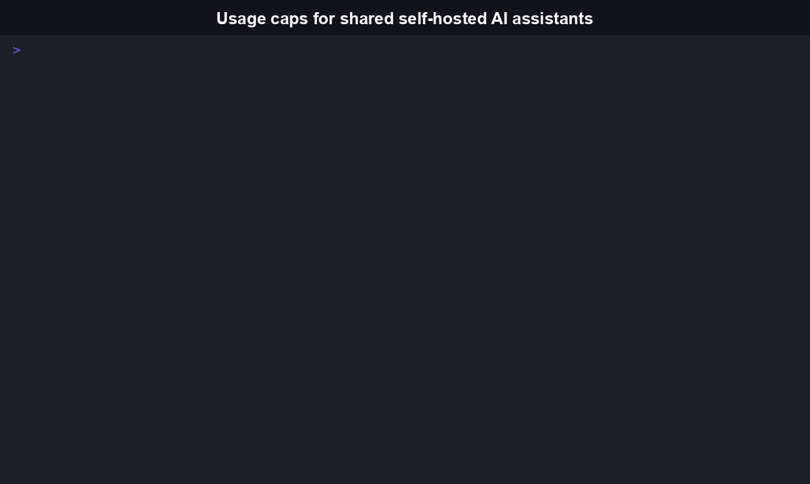
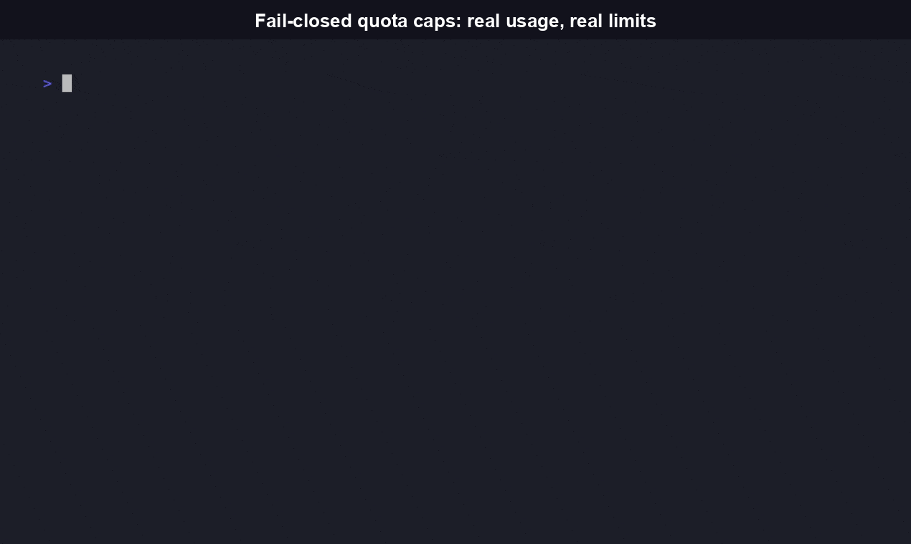

# WorkspaceGuard

Per-workspace usage metering and fail-closed quota caps for one shared self-hosted AI assistant deployment ([Odysseus](https://github.com/pewdiepie-archdaemon/odysseus) or a compatible backend).

[](https://github.com/RudrenduPaul/workspaceguard/actions/workflows/ci.yml)
[](https://www.npmjs.com/package/workspaceguard-cli)
[](https://pypi.org/project/workspaceguard-cli/)
[](https://github.com/RudrenduPaul/workspaceguard/blob/main/LICENSE)

Run Odysseus (or a compatible self-hosted assistant) for your household or small team and there's no way to see who sent how many messages this month, or to stop one person's usage from burning through everyone else's API budget. WorkspaceGuard is a sidecar that adds that layer: per-workspace message counts, an optional monthly cap that fails closed, and a CLI (or JSON) report an admin or another agent can read.

```bash
npx workspaceguard-cli usage
-> alex   [alex@example.com]: 812 messages this period, cap 1000 (81%)
-> jordan [jordan@example.com]: 203 messages this period, cap unlimited
```



## Install

```bash
npm install -g workspaceguard-cli
```

Or run it without installing:

```bash
npx workspaceguard-cli usage
```

The package is `workspaceguard-cli`; the command it installs is `workspaceguard`. A genuine, independent Python port with the same CLI surface and `--json` shapes is published separately as `workspaceguard-cli` on PyPI (`pip install workspaceguard-cli`, see [python/](./python)).

## Contents

- [Features](#features)
- [Quickstart](#quickstart)
- [CLI reference](#cli-reference)
- [Library API](#library-api)
- [Comparison](#comparison)
- [What is WorkspaceGuard, and why does it exist](#what-is-workspaceguard-and-why-does-it-exist)
- [Architecture](#architecture)
- [Trust boundary](#trust-boundary)
- [What's real vs. not yet built](#whats-real-vs-not-yet-built)
- [Docs](#docs)
- [FAQ](#faq)
- [Contributing and security](#contributing-and-security)
- [License](#license)

## Features

- **Per-workspace message counting.** Every request through the sidecar's `chat()` entry point increments a per-workspace, per-month counter (`src/core/usage.ts`), isolated so one workspace's usage never leaks into another's.
- **Quota enforcement that fails closed.** A workspace at its cap gets a `QuotaExceededError` before the backend is ever called. If the usage store is corrupted or unreadable, WorkspaceGuard blocks requests instead of silently resetting everyone's count to zero (fixed in 0.1.1, see [CHANGELOG.md](./CHANGELOG.md)).
- **Agent-native `--json` on every command.** `workspaceguard usage --json` returns structured output an orchestrator can parse directly, no screen-scraping.
- **AES-256-GCM vault with real key rotation.** `workspaceguard rotate-key <id>` re-encrypts a workspace's secrets under a new key and invalidates the old ciphertext.
- **A self-healing circuit breaker.** Backend calls open the circuit after 3 consecutive failures, then retry through a half-open probe and close again on success, instead of staying tripped forever.
- **One choke point, not scattered checks.** `chat()` in `src/core/isolation-guard.ts` is the single place every request flows through: resolve workspace, check quota, call backend, record usage.
- **Two independent, tested distributions.** The TypeScript package (npm) and the Python port (PyPI) implement the same design against separate test suites: 41/41 TypeScript tests and 50/50 Python tests passing as of this writing.

## Quickstart

```bash
# Register the workspaces sharing one deployment (identity = the header value
# your reverse proxy sets after authenticating, e.g. Cloudflare Access).
workspaceguard add-workspace alex --identity alex@example.com
workspaceguard add-workspace jordan --identity jordan@example.com

# Optional: cap alex at 1000 messages/month. Omit for unlimited (the default).
workspaceguard set-cap alex 1000

# See usage for every workspace.
workspaceguard usage
```

Real output from a fresh install:

```
-> alex [alex@example.com]: 0 messages this period, cap 1000 (0%)
-> jordan [jordan@example.com]: 0 messages this period, cap unlimited
```



## CLI reference

Every command accepts `--json` for a structured, agent-native output shape instead of the human-readable text shown below.

| Command | What it does |
|---|---|
| `workspaceguard init` | Initializes the data directory and vault for this deployment. |
| `workspaceguard add-workspace <id> --identity <value>` | Registers a workspace, idempotent on repeat calls for the same id. `--identity` is parsed positionally and must immediately follow `<id>`; it is not a free-standing flag. |
| `workspaceguard status [--json]` | Lists configured workspaces. |
| `workspaceguard usage [--json]` | Per-workspace message count, cap, and percent-used for the current month. |
| `workspaceguard set-cap <id> <count\|none>` | Sets or clears a workspace's monthly message cap. |
| `workspaceguard rotate-key <id>` | Rotates a workspace's vault encryption key (invalidates the old ciphertext). |
| `workspaceguard scan [--json]` | Isolation config scan (scaffold stub, carried over from the original build; always returns an empty finding list today). |
| `workspaceguard -h`, `--help` | Prints the command list above and exits `0`. |
| `workspaceguard -V`, `--version` | Prints the installed package version and exits `0`. |

### Global options

| Option | What it does |
|---|---|
| `--data-dir <path>` | Data directory for config, vault, and usage data. Takes precedence over `WORKSPACEGUARD_DATA_DIR`. |
| `--force` | `init` only: regenerate the master key even if an existing key file at the resolved data dir looks corrupted or truncated. **Warning:** permanently invalidates anything already encrypted under the old key. |
| `--json` | Structured, agent-native output instead of human-readable text. |

**Data directory resolution, in order:** `--data-dir` flag, then `WORKSPACEGUARD_DATA_DIR` env var, then `~/.workspaceguard`. This used to default to the current working directory with no override -- running `init` from the wrong shell could silently write a live encryption key into an unrelated directory. `init` on an existing, valid key is idempotent (it loads and reuses that key); `init` on a key file that exists but doesn't decode to a valid key refuses to overwrite it without `--force`.

```bash
$ workspaceguard usage --json
{"ok":true,"usage":[{"workspaceId":"alex","identity":"alex@example.com","monthlyMessageCap":1000,"percentUsed":81,"period":"2026-07","messageCount":812,"estimatedBytes":48213}]}
```

The `--json` mode is what makes this agent-native rather than just human-convenient: an orchestrator or monitoring agent can call `workspaceguard usage --json` and parse the result directly instead of scraping terminal output.

## Library API

```ts
import { createWorkspaceGuard, MockAdapter, QuotaExceededError } from "workspaceguard-cli";

const guard = await createWorkspaceGuard({ dataDir: "./data", backend: new MockAdapter() });
await guard.addWorkspace("alex", "alex@example.com");
await guard.setCap("alex", 1000);

try {
  await guard.chat("alex@example.com", "hello");
} catch (err) {
  if (err instanceof QuotaExceededError) {
    // alex is over their monthly cap
  }
}

const report = await guard.usageReport();
```

The Python port exposes the same shape: `from workspaceguard import create_workspace_guard, MockAdapter, QuotaExceededError`.

## Comparison

WorkspaceGuard is a sidecar, not a competing product. It sits in front of an Odysseus deployment (or a compatible backend) and adds the one layer that backend doesn't provide.

| Capability | WorkspaceGuard | Odysseus (native) |
|---|---|---|
| Per-user isolation (chat history, memory, API keys) | Not reimplemented; treated as already solved | Yes, built in by default |
| Per-workspace message counting | Yes | No |
| Monthly quota caps, fail-closed | Yes | No |
| CLI / `--json` usage report | Yes | No |
| License | MIT | AGPL-3.0 |

## What is WorkspaceGuard, and why does it exist

This project originally set out to add per-user workspace isolation (separate chat history, memory, API keys) to a self-hosted AI chat platform. A feasibility spike found that Odysseus already enforces per-user ownership on chat history, memory, and API tokens by default, so building a competing isolation layer would have duplicated work Odysseus already does correctly.

WorkspaceGuard instead keeps its tested isolation engine (namespace separation, an AES-256-GCM vault with real key rotation, fail-closed identity resolution, a self-healing circuit breaker) as the identity-resolution substrate, and builds the layer Odysseus doesn't provide: usage metering and quota enforcement per workspace.

**Free tier (this repo, MIT):** per-workspace message counting, monthly cap enforcement, a CLI/JSON usage report. **Not in this repo:** a hosted, multi-tenant billing dashboard is a separate, closed-source product, mentioned here only as a roadmap item and never merged into this MIT codebase.

## Architecture

- `src/core/isolation-guard.ts` -- the single choke point (`chat()`) every request flows through: resolve workspace, check quota, call backend, record usage.
- `src/core/usage.ts` -- the usage-metering engine this project adds: per-workspace, per-month counters with automatic period rollover, and `QuotaExceededError` enforcement.
- `src/core/vault.ts`, `src/core/namespace.ts`, `src/core/circuit-breaker.ts` -- the original isolation-engine code, kept as the identity and workspace-boundary substrate the metering layer reads from.
- `src/adapters/` -- the `BackendAdapter` interface. `MockAdapter` is the only implementation today; a real Odysseus HTTP adapter has not been built yet.

Backend-specific behavior never enters `src/core/` directly. Everything goes through `BackendAdapter`.

## Trust boundary

WorkspaceGuard trusts an upstream identity header (default: `Cf-Access-Authenticated-User-Email`) to resolve the workspace. It must never be directly reachable from the network, only from behind whatever trusted proxy sets that header (Cloudflare Access, Tailscale, etc.). This is documented, not code-enforced.

## What's real vs. not yet built

- **Real and tested:** usage metering, quota enforcement, the original isolation engine (vault, namespace separation, circuit breaker), and the CLI with `--json` mode, verified by 41/41 passing TypeScript tests and 50/50 passing Python tests.
- **Not yet built:** a real Odysseus HTTP adapter (only `MockAdapter` exists today) and a hosted, multi-tenant billing dashboard (deliberately out of scope for this MIT repo).

## Docs

- [docs/getting-started.md](./docs/getting-started.md)
- [docs/concepts.md](./docs/concepts.md)
- [docs/integrations/ci.md](./docs/integrations/ci.md)
- [docs/integrations/backends.md](./docs/integrations/backends.md)

## FAQ

**Q: What does WorkspaceGuard actually do?**
A: It adds per-workspace usage metering and quota enforcement in front of one shared self-hosted AI assistant deployment. It counts messages per workspace per month, lets you set an optional cap that fails closed once hit, and gives you (or an agent) a `workspaceguard usage` report. It does not add chat history, memory, or API key isolation itself; that already exists by default in the target platform (see "What is WorkspaceGuard" above), and WorkspaceGuard's own isolation code (`src/core/vault.ts`, `src/core/namespace.ts`) is kept only as the identity-resolution substrate the metering layer reads from.

**Q: What's WorkspaceGuard's actual differentiator?**
A: Narrow scope done well: not a full billing platform, and not a reimplementation of isolation the backend already has. Every request flows through one choke point (`chat()` in `src/core/isolation-guard.ts`), quota enforcement fails closed on a corrupted usage store instead of silently resetting everyone's usage to zero (fixed in 0.1.1, see [CHANGELOG.md](./CHANGELOG.md)), and every command supports `--json` for agent-native output.

**Q: How does WorkspaceGuard compare to Odysseus?**
A: It isn't a competing product. WorkspaceGuard is a sidecar that sits in front of an Odysseus deployment (or a compatible backend); it doesn't replace anything Odysseus already does. See the [comparison table](#comparison) above for the specific capability split.

**Q: What platforms does WorkspaceGuard run on?**
A: The npm package (`workspaceguard-cli`) requires Node.js 20 or newer (`engines.node` in `package.json`). The Python port in [`python/`](./python) requires Python 3.9 through 3.13 (see the classifiers in `python/pyproject.toml`). Neither distribution ships a platform-specific binary, so both run wherever their respective runtime does (Linux, macOS, Windows).

**Q: Is WorkspaceGuard a CLI, a library, or both?**
A: Both, in both distributions. The CLI (`workspaceguard <command>`) covers `init`, `add-workspace`, `status`, `usage`, `set-cap`, `rotate-key`, and `scan`. The same functionality is importable directly (`createWorkspaceGuard` from the TypeScript package, `create_workspace_guard` from the Python package) for anything that wants to call it from code instead of shelling out.

**Q: What's a real current limitation I should know about before relying on this?**
A: The only backend adapter implemented today is `MockAdapter`, an in-memory adapter used for tests and local experimentation. A real Odysseus HTTP adapter has not been built yet (see [docs/integrations/backends.md](./docs/integrations/backends.md)), so WorkspaceGuard does not yet forward live chat traffic to an actual Odysseus deployment. The metering and quota logic itself is real and tested; the network bridge to a live backend is the piece still outstanding.

**Q: Does WorkspaceGuard need its own API keys, or hold any of my AI provider credentials?**
A: No. The only backend adapter that exists right now (`MockAdapter`) is in-memory and calls no external API. All backend-specific behavior is isolated behind the `BackendAdapter` interface (`src/adapters/`), so WorkspaceGuard's own code never needs to see provider credentials directly.

**Q: Is WorkspaceGuard free to use commercially?**
A: Yes. This repository is MIT licensed in full, with no dual licensing and no feature gate. The hosted, multi-tenant billing dashboard mentioned above is a separate, closed-source product described only as a roadmap item; no billing-dashboard code lives in, or is withheld from, this MIT codebase.

## Contributing and security

See [CONTRIBUTING.md](./CONTRIBUTING.md) and [SECURITY.md](./SECURITY.md). Notable changes are tracked in [CHANGELOG.md](./CHANGELOG.md).

## License

MIT.
